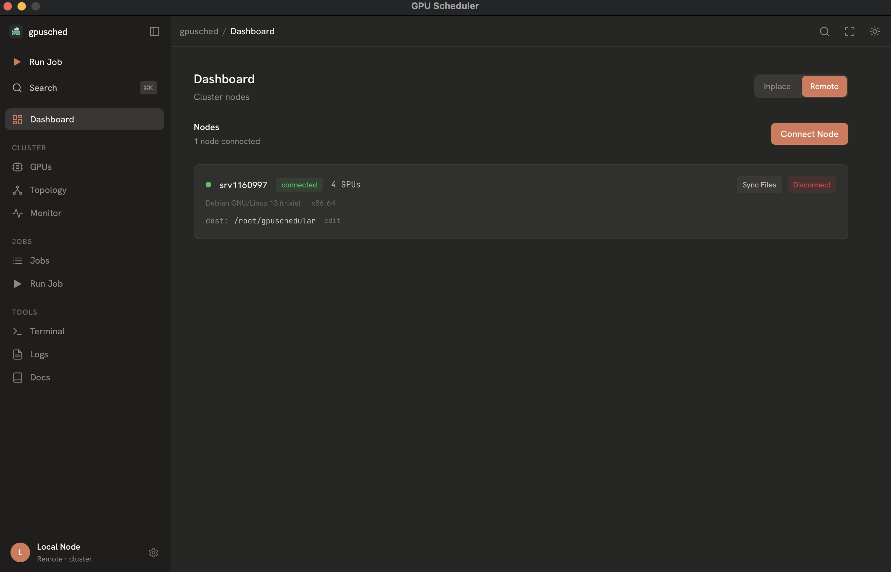
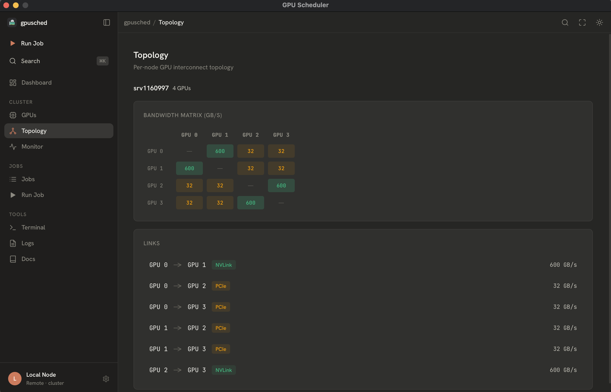
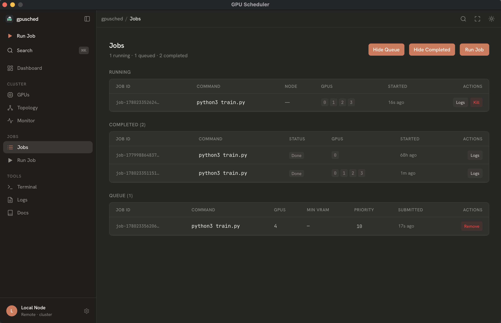
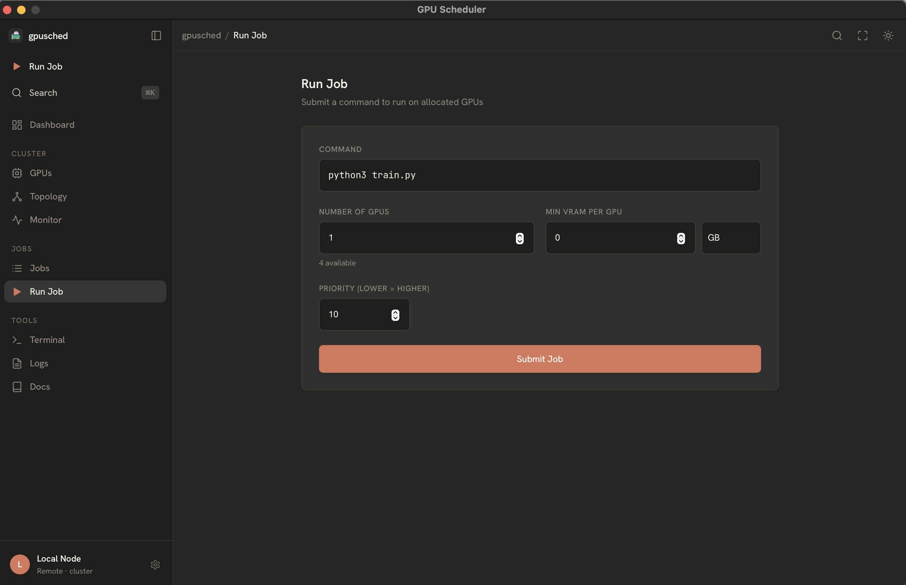
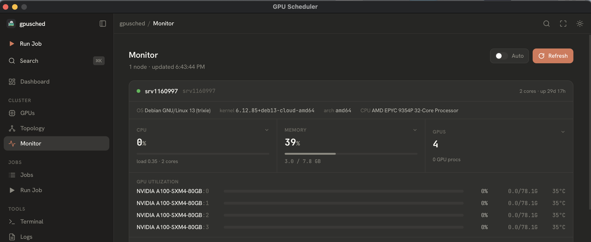
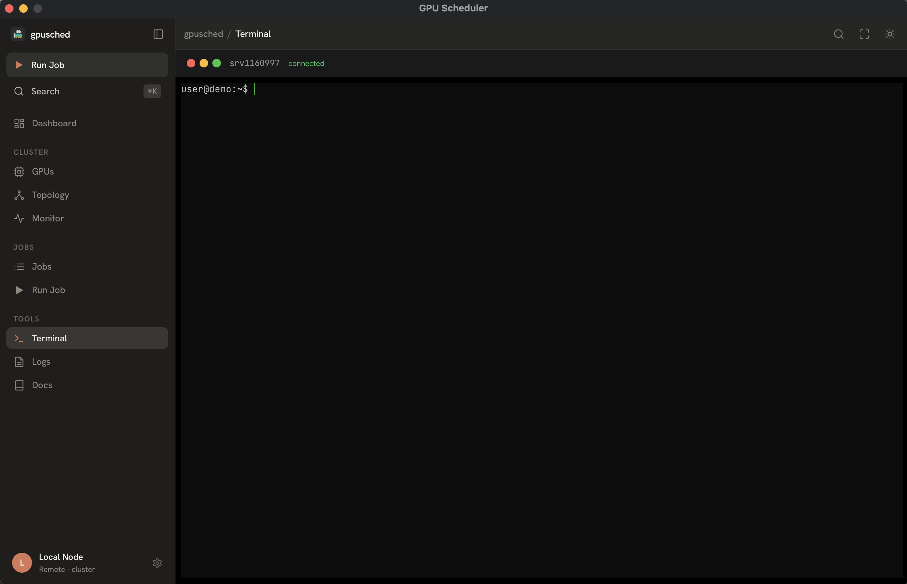
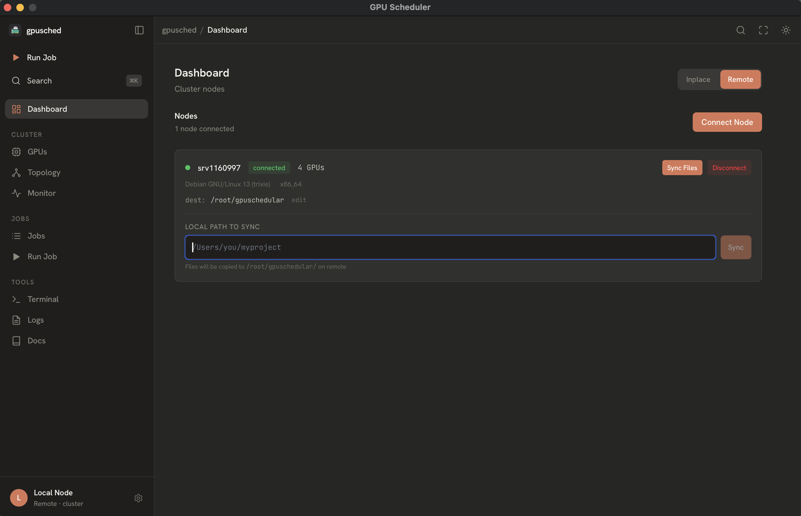

# GPU Scheduler Single Node

A high-performance GPU scheduler that optimizes resource utilization across multiple interconnects (NVLink, NVSwitch, XeLink, PCIe). Available as a desktop app with a companion CLI for terminal workflows.

## Overview

GPU Scheduler SN automatically detects your GPU hardware, analyzes interconnect topology, and intelligently schedules jobs to maximize performance. Whether you're running on a single workstation or managing a multi-node cluster, this tool ensures your GPU resources are used efficiently.

This project evolved from [gpu-orchestrator](https://github.com/john221wick/gpu-orchestrator), originally written in C++. After exploring different approaches, I rebuilt it in Go with embedded C for better cross-platform support, simpler deployment, and easier cluster management.

**Key capabilities:**
- Automatic GPU detection (NVIDIA, AMD, Intel, Apple Silicon)
- Topology-aware scheduling using bandwidth matrices
- Priority-based job queue with automatic placement
- Multi-node cluster support via SSH
- Real-time monitoring and management
- Cross-platform support (Linux, macOS, Windows)

## Installation

### Desktop App (Install or Update First)

Install or update the desktop app first if you want GPU Scheduler to appear as a normal desktop application. Re-run the same command whenever you want to update the desktop app to the latest release.

**macOS (Intel/Apple Silicon):**
```bash
curl -fsSL https://raw.githubusercontent.com/john221wick/gpuSchedularSN/main/install.sh | bash
```

**Linux (amd64/arm64):**
```bash
curl -fsSL https://raw.githubusercontent.com/john221wick/gpuSchedularSN/main/install.sh | bash
```

**Windows:** Desktop installer coming soon. Build from source for now.

### CLI Command (Optional)

Install the CLI only if you also want to run GPU Scheduler from a terminal.

**macOS (Intel/Apple Silicon):**
```bash
curl -fsSL https://raw.githubusercontent.com/john221wick/gpuSchedularSN/main/install.sh | bash -s -- --cli
```

**Linux (amd64/arm64):**
```bash
curl -fsSL https://raw.githubusercontent.com/john221wick/gpuSchedularSN/main/install.sh | bash -s -- --cli
```

**Windows:** CLI binary coming soon. Build from source for now.

### Desktop App + CLI

Install or update both with one command. The installer updates the desktop app first, then installs the CLI command.

**macOS and Linux:**
```bash
curl -fsSL https://raw.githubusercontent.com/john221wick/gpuSchedularSN/main/install.sh | bash -s -- --both
```


## Features (UI)

### Dashboard
Real-time overview of your GPU cluster with auto-refresh every 2 seconds. Shows total GPUs, free GPUs, running jobs, queued jobs, average utilization, and VRAM usage.



### GPU Topology Visualization
Visual representation of GPU interconnects and bandwidth matrix. Helps you understand how your GPUs are connected (NVLink, PCIe, etc.) and which combinations offer the best performance.



### Job Queue Management
Priority-based job queue with real-time status updates. Submit jobs, view running and queued tasks, and manage priorities. The scheduler automatically places jobs on the best GPU combination as resources free up.



### Job Submission
Simple interface to submit GPU jobs with customizable parameters like number of GPUs, VRAM requirements, and priority. Supports both local and cluster-wide job submission.



### System Monitoring
Comprehensive monitoring of CPU, memory, GPU utilization, Docker containers, and running processes across all connected nodes. Expandable panels show detailed metrics and top processes.



### Built-in Terminal
Integrated SSH terminal for direct access to remote nodes. Run commands, check logs, and manage your cluster without leaving the app.



### File Synchronization
Rsync-based file sync to push your code and data to remote nodes before job execution. Configure local and remote paths per node for seamless workflow.



## Documentation

For detailed documentation including architecture, API reference, cluster setup, and technical decisions, visit:

**[https://john221wick.github.io/gpuSchedularSN/](https://john221wick.github.io/gpuSchedularSN/)**

- [Development Phases](https://john221wick.github.io/gpuSchedularSN/development-phases.html) - Step-by-step evolution of the project
- [Technical Decisions](https://john221wick.github.io/gpuSchedularSN/technical-decisions.html) - Why Go + embedded C, topology scoring, and more

## Quick Start

```bash
# List detected GPUs
gpusched devices

# View GPU topology and interconnects
gpusched topo

# Run a job on 2 GPUs with 40GB VRAM each
gpusched run --gpus 2 --vram 40g -- python train.py

# Check job status
gpusched status

# View job logs
gpusched logs <job-id>

# Kill a running job
gpusched kill <job-id>
```


## Supported GPUs

| Vendor | Detection Method | Environment Variable |
|--------|------------------|---------------------|
| NVIDIA | nvidia-smi | `CUDA_VISIBLE_DEVICES` |
| AMD | ROCm SMI, with AMDGPU sysfs fallback | `HIP_VISIBLE_DEVICES` |
| Intel | GPU metrics | `GPU_DEVICE_ORDINAL` |
| Apple | Metal/sysctl | Native (single GPU) |

## Supported Interconnects

- **NVLink** (NVIDIA) - Up to 600 GB/s
- **NVSwitch** (NVIDIA) - Up to 900 GB/s
- **PCIe** (All vendors) - Up to 64 GB/s
- **XGMI/Infinity Fabric** (AMD) - Up to 64 GB/s
- **XeLink** (Intel) - Up to 42 GB/s
- **Thunderbolt** (Apple) - Up to 10 GB/s
- **Unified Memory** (Apple Silicon) - N/A
